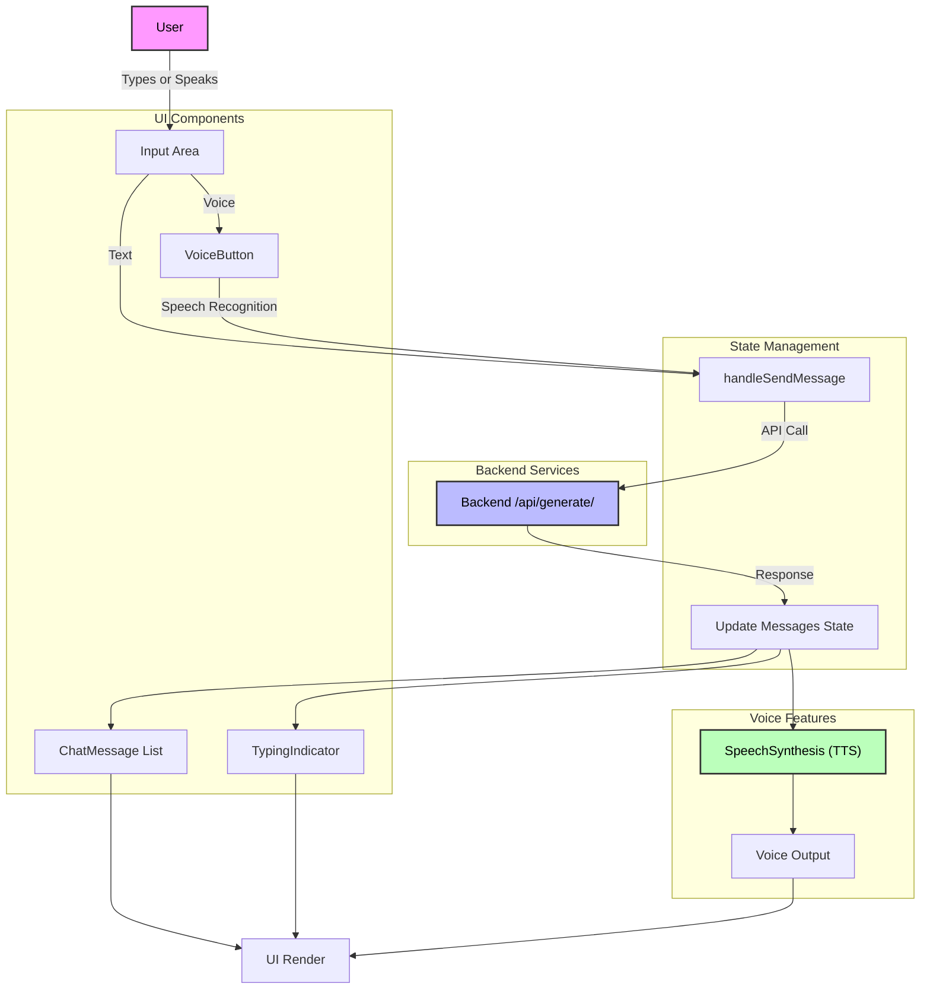

# Advanced AI Chatbot with Voice Integration

A modern, full-stack conversational AI application featuring voice input/output, session management, and code generation capabilities. Built with FastAPI, React, TypeScript, and powered by Groq LLMs through LangChain.

## 🎥 Demo

Watch a quick demo of the chatbot in action:

[](https://www.youtube.com/watch?v=sinhAaDLKyw)

*Replace `YOUR_VIDEO_ID` with your actual YouTube video ID.*

---

## 📑 Table of Contents
1. [Features](#-features)
2. [Tech Stack](#-tech-stack)
3. [Project Structure](#-project-structure)
4. [API Endpoints](#-api-endpoints)
5. [Getting Started](#-getting-started)
6. [Architecture Overview](#-architecture-overview)
7. [Deployment](#-deployment)
8. [Contributing](#-contributing)
9. [License](#-license)

---

## 🚀 Features

- **Conversational AI**: Natural chat with session-based memory and context awareness
- **Voice Integration**: 
  - Speech-to-text input using Web Speech API
  - Text-to-speech output with mute/unmute controls
  - Visual feedback for voice interactions
- **Code Generation**: Generate clean, executable code from natural language prompts
- **Smart Explanations**: Step-by-step programming concepts and code explanations
- **Session Management**: 
  - Create, view, and delete chat sessions
  - Persistent conversation history
  - Session-based memory retention
- **Modern UI**: 
  - Responsive design with shadcn-ui components
  - Real-time typing indicators
  - Smooth animations and transitions
- **API Health Monitoring**: Real-time model and server status checks

---

## 🛠️ Tech Stack

### Frontend
- **Framework**: React 18 with TypeScript
- **Build Tool**: Vite
- **Styling**: Tailwind CSS
- **UI Components**: shadcn-ui
- **Voice APIs**: Web Speech API (Speech Recognition & Synthesis)

### Backend
- **Framework**: FastAPI
- **Language**: Python 3.8+
- **AI/ML**: LangChain, Groq LLMs
- **Database**: SQLite (with potential for PostgreSQL/MySQL)
- **Memory**: Session-based conversation memory

### Deployment
- **Containerization**: Docker
- **Platforms**: Hugging Face Spaces, Lovable
- **Custom Domains**: Supported

---

## 🗂️ Project Structure

```
.
├── app.py                  # FastAPI application entry point
├── api/                    # API endpoints and Pydantic models
│   ├── endpoints.py        # Route definitions
│   └── models.py          # Request/response models
├── core/                   # Core business logic
│   ├── llm.py             # LLM integration and configuration
│   ├── memory.py          # Session memory management
│   └── utils.py           # Utility functions
├── requirements.txt        # Python dependencies
├── Dockerfile             # Container configuration
├── chatbot.db            # SQLite database for sessions
├── ui/                   # React frontend application
│   ├── package.json
│   ├── vite.config.ts
│   ├── tailwind.config.ts
│   ├── src/
│   │   ├── App.tsx
│   │   ├── components/    # Reusable React components
│   │   ├── pages/        # Application pages
│   │   ├── hooks/        # Custom React hooks
│   │   ├── lib/          # Utility libraries
│   │   └── types/        # TypeScript type definitions
│   └── public/           # Static assets
└── docs/                 # Documentation files
```

---

## 🔌 API Endpoints

| Method | Endpoint | Description |
|--------|----------|-------------|
| `POST` | `/generate/` | Generate AI response (conversation, code, or explanation) |
| `POST` | `/get_history/` | Retrieve conversation history for a session |
| `POST` | `/clear_history/` | Clear conversation history for a session |
| `GET` | `/sessions/` | List all active sessions |
| `DELETE` | `/sessions/{session_id}` | Delete a specific session |
| `GET` | `/health` | Health check and model status |

### Example API Usage

**Generate a response:**
```bash
curl -X POST http://localhost:7860/generate/ \
  -H 'Content-Type: application/json' \
  -d '{
    "prompt": "Write a Python function to reverse a string.",
    "response_type": "both",
    "session_id": "optional-session-id"
  }'
```

**Get session history:**
```bash
curl -X POST http://localhost:7860/get_history/ \
  -H 'Content-Type: application/json' \
  -d '{"session_id": "your-session-id"}'
```

---

## 🚀 Getting Started

### Prerequisites
- **Node.js** (v16+) & npm - [Install with nvm](https://github.com/nvm-sh/nvm)
- **Python** (3.8+)
- **Groq API Key** - [Get one here](https://console.groq.com/)

### Local Development Setup

1. **Clone the repository**
   ```bash
   git clone <YOUR_GIT_URL>
   cd advanced-chatbot
   ```

2. **Backend Setup**
   ```bash
   # Create and activate virtual environment
   python -m venv venv
   
   # On Windows:
   venv\Scripts\activate
   # On macOS/Linux:
   source venv/bin/activate
   
   # Install dependencies
   pip install -r requirements.txt
   ```

3. **Environment Configuration**
   Create a `.env` file in the root directory:
   ```env
   GROQ_API_KEY=your_groq_api_key_here
   GROQ_MODEL=llama2-70b-4096
   MAX_LENGTH=512
   TEMPERATURE=0.2
   ```

4. **Frontend Setup**
   ```bash
   cd ui
   npm install
   ```

5. **Start the Application**
   ```bash
   # Terminal 1: Start backend (from root directory)
   uvicorn app:app --reload --port 7860
   
   # Terminal 2: Start frontend (from ui/ directory)
   cd ui
   npm run dev
   ```

6. **Access the Application**
   - Frontend: http://localhost:8080
   - Backend API: http://localhost:7860
   - API Documentation: http://localhost:7860/docs

---

## 🏗️ Architecture Overview

### Main Chat Flow
This diagram shows the journey of a user message through the chat application:



### State Management
The application manages several key states for optimal user experience:

- **Idle**: Ready for user input (voice/text)
- **Listening**: Capturing voice input with visual feedback
- **Processing**: Converting speech to text and processing intent
- **Sending**: Transmitting request to backend
- **Responding**: Receiving and processing AI response
- **Speaking**: Text-to-speech output with playback controls

---

## 🚀 Deployment

### Lovable Platform
1. Open your [Lovable project](https://lovable.dev/projects/346d97cd-baa4-4aec-affe-b14c90da28a0)
2. Click **Share** → **Publish**
3. Your app will be live instantly

### Hugging Face Spaces
1. Create a new Space with Python SDK
2. Push this repository to your Space
3. Configure secrets in Space settings:
   - `GROQ_API_KEY`: Your Groq API key
   - `GROQ_MODEL`: (Optional) Model name
4. App auto-deploys on port 7860

### Docker Deployment
```bash
# Build the image
docker build -t advanced-chatbot .

# Run the container
docker run -p 7860:7860 -e GROQ_API_KEY=your_key_here advanced-chatbot
```

### Custom Domain Setup
For custom domains on Lovable:
1. Navigate to **Project** → **Settings** → **Domains**
2. Click **Connect Domain**
3. Follow the [domain setup guide](https://docs.lovable.dev/tips-tricks/custom-domain#step-by-step-guide)

---

## 💡 Usage Tips

- **Voice Input**: Click the microphone icon and speak clearly
- **Voice Output**: Use the speaker icon to mute/unmute responses
- **Session Management**: Create new sessions for different conversation contexts
- **Code Generation**: Be specific about requirements and programming language
- **Error Handling**: The app gracefully handles API errors and connection issues

---

## 🤝 Contributing

We welcome contributions! Here's how to get started:

1. **Fork** this repository
2. **Create** a feature branch (`git checkout -b feature/amazing-feature`)
3. **Commit** your changes (`git commit -m 'Add amazing feature'`)
4. **Push** to the branch (`git push origin feature/amazing-feature`)
5. **Open** a Pull Request

### Development Guidelines
- Follow existing code style and conventions
- Add tests for new features
- Update documentation as needed
- For major changes, open an issue first to discuss

---

## 📄 License

This project is licensed under the MIT License. See the [LICENSE](MIT) file for details.

---

## 🙏 Acknowledgements

- **[Lovable](https://lovable.dev/)** - Development platform
- **[Groq](https://groq.com/)** - Fast LLM inference
- **[LangChain](https://langchain.com/)** - LLM framework
- **[shadcn-ui](https://ui.shadcn.com/)** - UI components
- **[Tailwind CSS](https://tailwindcss.com/)** - Styling framework
- **[FastAPI](https://fastapi.tiangolo.com/)** - Backend framework
- **[React](https://react.dev/)** & **[Vite](https://vitejs.dev/)** - Frontend tools

---

## 📞 Support

- **Documentation**: Check our [docs](./docs/) folder
- **Issues**: [GitHub Issues](https://github.com/your-repo/issues)
- **Discussions**: [GitHub Discussions](https://github.com/your-repo/discussions)

---

**Built with ❤️ by the development team**
